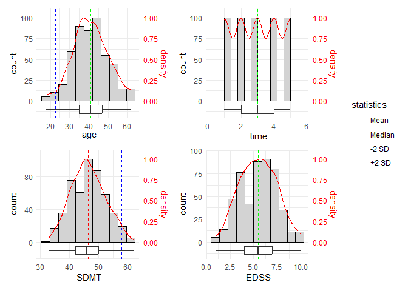

<!-- README.md is generated from README.Rmd. Please edit that file -->

# samspack

<!-- badges: start -->

[](https://github.com/snhof/samspack/actions/workflows/R-CMD-check.yaml)
<!-- badges: end -->

Samspack is a personal R package containing functions frequently used in
data analysis and visualization, with a focus on multiple sclerosis (MS)
research and eye-tracking data. It provides:

- **Multiple regression helpers** — run many regression models in one
  call and get a tidy summary table.
- **DEMoNS eye-tracking processing** — process raw output from the
  [DEMoNS
  protocol](https://www.protocols.io/view/demons-protocol-for-measurement-and-analysis-of-ey-x54v98eyml3e/v3)
  tasks (fixation, pro-saccades, anti-saccades, express saccades,
  double-step saccades, repeated saccades).
- **INO detection** — calculate versional dysconjugacy indices and
  determine presence of internuclear ophthalmoplegia (INO).
- **VFQ-25 scoring** — score the Visual Function Questionnaire-25 (Dutch
  version).

## Installation

You can install the development version of samspack from
[GitHub](https://github.com/) with:

``` r
# install.packages("remotes")
remotes::install_github("snhof/samspack")
```

## Multiple regression helpers

The regression helper functions let you specify vectors of outcome
variables, predictors, and covariates. The functions then run every
combination and return a single tidy results table.

Four model types are supported:

| Function            | Model type                            |
|---------------------|---------------------------------------|
| `lm_mult()`         | Linear regression (`lm`)              |
| `lmer_mult()`       | Linear mixed-effects model (`lmer`)   |
| `glm_log_mult()`    | Logistic regression (`glm`, binomial) |
| `geeglm_log_mult()` | Logistic GEE regression (`geeglm`)    |

### Linear regression example

``` r
library(samspack)

lm_mult(
  data       = MS_trial_data,
  outcomes   = c("EDSS", "SDMT"),
  predictors = "age",
  covariates = c("", "+ gender")
)
#> # A tibble: 10 × 13
#>    model  outcome predictor covariate formula term  estimate std.error statistic
#>    <chr>  <chr>   <chr>     <chr>     <chr>   <chr>    <dbl>     <dbl>     <dbl>
#>  1 Linea… EDSS    age       ""        EDSS ~… (Int…   6.28     0.394      15.9  
#>  2 Linea… EDSS    age       ""        EDSS ~… age    -0.0197   0.0094     -2.09 
#>  3 Linea… EDSS    age       "+ gende… EDSS ~… (Int…   6.22     0.413      15.0  
#>  4 Linea… EDSS    age       "+ gende… EDSS ~… age    -0.0194   0.00943    -2.06 
#>  5 Linea… EDSS    age       "+ gende… EDSS ~… gend…   0.0833   0.173       0.482
#>  6 Linea… SDMT    age       ""        SDMT ~… (Int…  47.1      1.18       40.0  
#>  7 Linea… SDMT    age       ""        SDMT ~… age    -0.0151   0.0281     -0.536
#>  8 Linea… SDMT    age       "+ gende… SDMT ~… (Int…  46.7      1.23       37.8  
#>  9 Linea… SDMT    age       "+ gende… SDMT ~… age    -0.0130   0.0281     -0.461
#> 10 Linea… SDMT    age       "+ gende… SDMT ~… gend…   0.603    0.516       1.17 
#> # ℹ 4 more variables: p.value <dbl>, conf.low <dbl>, conf.high <dbl>,
#> #   error <lgl>
```

### Linear mixed-effects model example

``` r
lmer_mult(
  data       = MS_trial_data,
  outcomes   = c("EDSS", "SDMT"),
  predictors = c("intervention", "intervention * time"),
  covariates = c("", "+ age + gender"),
  randoms    = c("+ (1|pat_id)")
)
#> Warning: There were 2 warnings in `dplyr::mutate()`.
#> The first warning was:
#> ℹ In argument: `ranova = purrr::map(...)`.
#> Caused by warning:
#> ! the 'nobars' function has moved to the reformulas package. Please update your imports, or ask an upstream package maintainter to do so.
#> This warning is displayed once per session.
#> ℹ Run `dplyr::last_dplyr_warnings()` to see the 1 remaining warning.
#> # A tibble: 48 × 24
#>    model_type      outcome predictor covariate random formula effect group term 
#>    <chr>           <chr>   <chr>     <chr>     <chr>  <chr>   <chr>  <chr> <chr>
#>  1 Linear mixed m… EDSS    interven… ""        + (1|… EDSS ~… fixed  <NA>  (Int…
#>  2 Linear mixed m… EDSS    interven… ""        + (1|… EDSS ~… fixed  <NA>  inte…
#>  3 Linear mixed m… EDSS    interven… ""        + (1|… EDSS ~… ran_p… pat_… sd__…
#>  4 Linear mixed m… EDSS    interven… ""        + (1|… EDSS ~… ran_p… Resi… sd__…
#>  5 Linear mixed m… EDSS    interven… "+ age +… + (1|… EDSS ~… fixed  <NA>  (Int…
#>  6 Linear mixed m… EDSS    interven… "+ age +… + (1|… EDSS ~… fixed  <NA>  inte…
#>  7 Linear mixed m… EDSS    interven… "+ age +… + (1|… EDSS ~… fixed  <NA>  age  
#>  8 Linear mixed m… EDSS    interven… "+ age +… + (1|… EDSS ~… fixed  <NA>  gend…
#>  9 Linear mixed m… EDSS    interven… "+ age +… + (1|… EDSS ~… ran_p… pat_… sd__…
#> 10 Linear mixed m… EDSS    interven… "+ age +… + (1|… EDSS ~… ran_p… Resi… sd__…
#> # ℹ 38 more rows
#> # ℹ 15 more variables: estimate <dbl>, std.error <dbl>, statistic <dbl>,
#> #   df <dbl>, p.value <dbl>, conf.low <dbl>, conf.high <dbl>, isSingular <lgl>,
#> #   logLik <dbl>, deviance <dbl>, term_ranova <lgl>, npar_ranova <lgl>,
#> #   p_ranova <lgl>, model <list>, model_error <lgl>
```

### Logistic regression example

``` r
glm_log_mult(
  data       = MS_trial_data,
  outcomes   = "INO",
  predictors = c("intervention", "age"),
  covariates = c("", "+ gender")
)
#> # A tibble: 10 × 13
#>    model      outcome predictor covariate formula error term  estimate std.error
#>    <chr>      <chr>   <chr>     <chr>     <chr>   <lgl> <chr>    <dbl>     <dbl>
#>  1 Logistic … INO     interven… ""        INO ~ … NA    (Int…     2.31    0.139 
#>  2 Logistic … INO     interven… ""        INO ~ … NA    inte…     1.26    0.200 
#>  3 Logistic … INO     interven… "+ gende… INO ~ … NA    (Int…     2.25    0.180 
#>  4 Logistic … INO     interven… "+ gende… INO ~ … NA    inte…     1.27    0.200 
#>  5 Logistic … INO     interven… "+ gende… INO ~ … NA    gend…     1.05    0.202 
#>  6 Logistic … INO     age       ""        INO ~ … NA    (Int…     1.75    0.459 
#>  7 Logistic … INO     age       ""        INO ~ … NA    age       1.01    0.0111
#>  8 Logistic … INO     age       "+ gende… INO ~ … NA    (Int…     1.67    0.483 
#>  9 Logistic … INO     age       "+ gende… INO ~ … NA    age       1.01    0.0111
#> 10 Logistic … INO     age       "+ gende… INO ~ … NA    gend…     1.06    0.202 
#> # ℹ 4 more variables: statistic <dbl>, p.value <dbl>, conf.low <dbl>,
#> #   conf.high <dbl>
```

### Logistic GEE regression example

``` r
geeglm_log_mult(
  data       = MS_trial_data,
  outcomes   = "INO",
  predictors = c("intervention", "intervention * time"),
  covariates = c("", "+ gender + age"),
  id         = "pat_id"
)
#> Warning: There were 48 warnings in `dplyr::mutate()`.
#> The first warning was:
#> ℹ In argument: `model = `%>%`(...)`.
#> Caused by warning in `diff()`:
#> ! NAs introduced by coercion
#> ℹ Run `dplyr::last_dplyr_warnings()` to see the 47 remaining warnings.
#> # A tibble: 16 × 12
#>    model  outcome predictor covariate formula term  estimate std.error statistic
#>    <chr>  <chr>   <chr>     <chr>     <chr>   <chr>    <dbl>     <dbl>     <dbl>
#>  1 Logis… INO     interven… ""        INO~in… (Int…    2.31    0         2.02e20
#>  2 Logis… INO     interven… ""        INO~in… inte…    1.26  NaN       NaN      
#>  3 Logis… INO     interven… "+ gende… INO~in… (Int…    1.33  NaN       NaN      
#>  4 Logis… INO     interven… "+ gende… INO~in… inte…    1.31  NaN       NaN      
#>  5 Logis… INO     interven… "+ gende… INO~in… gend…    1.07    0.00013   2.42e 5
#>  6 Logis… INO     interven… "+ gende… INO~in… age      1.01  NaN       NaN      
#>  7 Logis… INO     interven… ""        INO~in… (Int…    0.704 NaN       NaN      
#>  8 Logis… INO     interven… ""        INO~in… inte…    1.77    0.00458   1.56e 4
#>  9 Logis… INO     interven… ""        INO~in… time     1.52  NaN       NaN      
#> 10 Logis… INO     interven… ""        INO~in… inte…    0.886   0.00313   1.48e 3
#> 11 Logis… INO     interven… "+ gende… INO~in… (Int…    0.392   0.204     2.11e 1
#> 12 Logis… INO     interven… "+ gende… INO~in… inte…    1.84    0.130     2.21e 1
#> 13 Logis… INO     interven… "+ gende… INO~in… time     1.52    0.0756    3.06e 1
#> 14 Logis… INO     interven… "+ gende… INO~in… gend…    1.07    0.0233    8.72e 0
#> 15 Logis… INO     interven… "+ gende… INO~in… age      1.01    0.00323   1.58e 1
#> 16 Logis… INO     interven… "+ gende… INO~in… inte…    0.886 NaN       NaN      
#> # ℹ 3 more variables: p.value <dbl>, conf.low <dbl>, conf.high <dbl>
```

### Constructing formulas manually

`construct_formulas()` builds a data frame of all formula combinations,
which can be passed directly to any of the regression helpers or used
with base R model functions.

``` r
construct_formulas(
  outcomes   = c("EDSS", "SDMT"),
  predictors = "intervention",
  covariates = c("", "+ age"),
  randoms    = c("", "+ (1|pat_id)")
)
#> # A tibble: 8 × 5
#>   outcome predictor    covariate random         formula                         
#>   <chr>   <chr>        <chr>     <chr>          <chr>                           
#> 1 EDSS    intervention ""        ""             EDSS ~ intervention             
#> 2 EDSS    intervention ""        "+ (1|pat_id)" EDSS ~ intervention+ (1|pat_id) 
#> 3 EDSS    intervention "+ age"   ""             EDSS ~ intervention+ age        
#> 4 EDSS    intervention "+ age"   "+ (1|pat_id)" EDSS ~ intervention+ age+ (1|pa…
#> 5 SDMT    intervention ""        ""             SDMT ~ intervention             
#> 6 SDMT    intervention ""        "+ (1|pat_id)" SDMT ~ intervention+ (1|pat_id) 
#> 7 SDMT    intervention "+ age"   ""             SDMT ~ intervention+ age        
#> 8 SDMT    intervention "+ age"   "+ (1|pat_id)" SDMT ~ intervention+ age+ (1|pa…
```

## DEMoNS eye-tracking data processing

The `demons_process_*` functions add derived parameters and dichotomous
outcome variables (based on published cut-offs) to raw DEMoNS output.
Each function corresponds to one task in the protocol.

| Function                   | Task                 |
|----------------------------|----------------------|
| `demons_process_fix()`     | Fixation             |
| `demons_process_prosac()`  | Pro-saccades         |
| `demons_process_antisac()` | Anti-saccades        |
| `demons_process_expsac()`  | Express saccades     |
| `demons_process_dblstep()` | Double-step saccades |
| `demons_process_repsac()`  | Repeated saccades    |

Example datasets (`DEMoNS_data`, `DEMoNS_data_fix`,
`DEMoNS_data_prosac`, etc.) are included for testing and demonstration.

``` r
demons_process_fix(DEMoNS_data_fix, keep_essential = TRUE, add_prefix = TRUE)
#> # A tibble: 2 × 39
#>   Research_number     Date                fix_T_Number_fixperi…¹ fix_C_SD_X_gaze
#>   <chr>               <dttm>                               <dbl>           <dbl>
#> 1 DEMoNS reference S… 2023-06-08 00:00:00                     10          0.0874
#> 2 DEMoNS test Eng Sam 2023-06-08 00:00:00                     10          0.211 
#> # ℹ abbreviated name: ¹​fix_T_Number_fixperiods
#> # ℹ 35 more variables: fix_C_Fix_SD_X_gaze <dbl>, fix_C_SD_Y_gaze <dbl>,
#> #   fix_C_Fix_SD_Y_gaze <dbl>, fix_C_BCEA_gaze <dbl>,
#> #   fix_C_Fix_BCEA_gaze <dbl>, fix_C_Mean_amplitude_SWJ <dbl>,
#> #   fix_C_Mean_amplitude_sac <dbl>, fix_C_Mean_amplitude_SWJSac <dbl>,
#> #   fix_C_MeanNr_SWJmin4_persec <dbl>, fix_C_MeanNr_SWJplus4_persec <dbl>,
#> #   fix_C_Mean_sacmin2_sec <dbl>, fix_C_Mean_sacplus2_sec <dbl>, …
```

## INO detection

`calcINO()` (a wrapper for `demons_process_INO()`) processes
pro-saccades data and uses versional dysconjugacy index (VDI) cut-off
values to classify eyes as INO-positive or INO-negative.

``` r
calcINO(DEMoNS_data_prosac)
#> # A tibble: 2 × 254
#>   File      Research_number Date                T_Number_saccades T_Peakvelocity
#>   <chr>     <chr>           <dttm>                          <dbl>          <dbl>
#> 1 DEMoNS r… DEMoNS referen… 2023-06-08 00:00:00                59           367.
#> 2 DEMoNS t… DEMoNS test En… 2023-06-08 00:00:00                53           378.
#> # ℹ 249 more variables: T_SD_peakvelocity <dbl>, T_VDI_peakvelocity <dbl>,
#> #   T_SD_VDI_peakvelocity <dbl>, T_Peakacceleration <dbl>,
#> #   T_SD_peakacceleration <dbl>, T_VDI_peakacceleration <dbl>,
#> #   T_SD_VDI_peakacceleration <dbl>, T_Latency <dbl>, T_SD_latency <dbl>,
#> #   T_Gain <dbl>, T_SD_gain...16 <dbl>, T_FPG <dbl>, T_SD_FPG <dbl>,
#> #   T_VDI_FPG <dbl>, T_SD_VDI_FPG <dbl>, T_Number_saccades_FPG <dbl>,
#> #   T_AUC_total <dbl>, T_SD_AUC_total <dbl>, T_VDI_AUC <dbl>, …
```

## VFQ-25 scoring

`VFQ_scoring()` converts raw Dutch-language VFQ-25 questionnaire
responses to numerical subscale scores and a composite total score.

``` r
# df is a data frame with columns named VFQ1 through VFQ25
VFQ_scoring(df)
```

## Checking distributions and outliers

### check_histograms()

`check_histograms()` is one of the most frequently used functions in the
package. It iterates over every numeric variable in a data frame and
returns a list of histograms, each showing the mean, median, ±2 SD
lines, a boxplot, a density curve, and outlier labels.

``` r
check_histograms(data = MS_trial_data, id = pat_id, facet_cols = gender)[[1]]
```


Use `wrap_plots_split()` to display the list of plots across multiple
pages (4 plots per page by default):

``` r
check_histograms(data = MS_trial_data, id = pat_id) %>% wrap_plots_split()
#> [[1]]
```



`histogram_sp()` creates a single histogram with the same annotations
and is the underlying function called by `check_histograms()`.

### check_scatterplots()

`check_scatterplots()` creates scatterplots for all combinations of
specified outcome and predictor variables, with outliers automatically
labeled.

``` r
check_scatterplots(
  data       = MS_trial_data,
  outcomes   = c("EDSS", "SDMT"),
  predictors = c("age", "time"),
  id         = pat_id
)[[1]]
#> `geom_smooth()` using formula = 'y ~ x'
```


## Checking model assumptions

### lmer_assump_tests()

`lmer_assump_tests()` takes a fitted `lmer` model and returns a combined
plot for checking the three key assumptions: normality of residuals
(histogram), linearity (residuals vs fitted), and normality of random
effects (QQ-plot).

``` r
model <- lme4::lmer(SDMT ~ intervention + (1|pat_id), data = MS_trial_data, REML = FALSE)
lmer_assump_tests(model)
```


`lmer_mult_assump_tests()` is a convenience wrapper that mirrors
`lmer_mult()` and returns an assumption-check plot for every model in
the batch.

### lm_assump_tests()

`lm_assump_tests()` takes a fitted `lm` model and returns a combined
plot for normality of residuals and linearity/homoscedasticity.

``` r
lm_assump_tests(lm(SDMT ~ age, data = MS_trial_data))
```


`lm_mult_assump_tests()` is a convenience wrapper that mirrors
`lm_mult()` and returns an assumption-check plot for every model in the
batch.

## Function reference

Below is a complete list of all exported functions grouped by category.

### Multiple regression — run models

| Function | Description |
|----|----|
| `construct_formulas()` | Build a data frame of all formula combinations from vectors of outcomes, predictors, covariates and random effects |
| `lm_mult()` | Run multiple linear regression models (`lm`) and return a tidy results table |
| `lmer_mult()` | Run multiple linear mixed-effects models (`lmer`) and return a tidy results table |
| `glm_log_mult()` | Run multiple logistic regression models (`glm`, binomial) and return a tidy results table |
| `geeglm_log_mult()` | Run multiple logistic GEE regression models (`geeglm`) and return a tidy results table |

### Multiple regression — assumption checks

| Function | Description |
|----|----|
| `lm_assump_tests()` | Assumption-check plots for a single `lm` model |
| `lm_mult_assump_tests()` | Assumption-check plots for a batch of `lm` models |
| `lmer_assump_tests()` | Assumption-check plots for a single `lmer` model |
| `lmer_mult_assump_tests()` | Assumption-check plots for a batch of `lmer` models |

### Exploratory data analysis

| Function | Description |
|----|----|
| `check_histograms()` | Histograms with mean, median, ±2 SD, boxplot, density and outlier labels for all numeric variables in a data frame |
| `histogram_sp()` | Single histogram with the same annotations as `check_histograms()` |
| `check_scatterplots()` | Scatterplots for all outcome × predictor combinations with outlier labels |
| `is_outlier()` | Detect outliers using the Tukey method (Q1/Q3 ± 1.5 × IQR) |
| `wrap_plots_split()` | Split a list of ggplot objects into pages of *n* plots |

### DEMoNS eye-tracking

| Function | Description |
|----|----|
| `demons_process_fix()` | Process fixation task data |
| `demons_process_prosac()` | Process pro-saccades task data |
| `demons_process_antisac()` | Process anti-saccades task data |
| `demons_process_expsac()` | Process express saccades task data |
| `demons_process_dblstep()` | Process double-step saccades task data |
| `demons_process_repsac()` | Process repeated saccades task data |
| `calcINO()` | Calculate VDI metrics and classify INO from pro-saccades data |

### Questionnaires and clinical scores

| Function | Description |
|----|----|
| `VFQ_scoring()` | Score the Dutch VFQ-25 questionnaire into subscale and total scores |

### Saving plots

| Function | Description |
|----|----|
| `ggsavepp()` | Save a ggplot with dimensions optimised for a PowerPoint slide |
| `ggsavepphalf()` | Save a ggplot at half PowerPoint slide width |
| `ggsaveppfull()` | Save a ggplot at full PowerPoint slide dimensions |
| `ggsaveppquart()` | Save a ggplot at quarter PowerPoint slide dimensions |
| `ggsavemagnify()` | Save a ggplot with a custom magnification factor |
