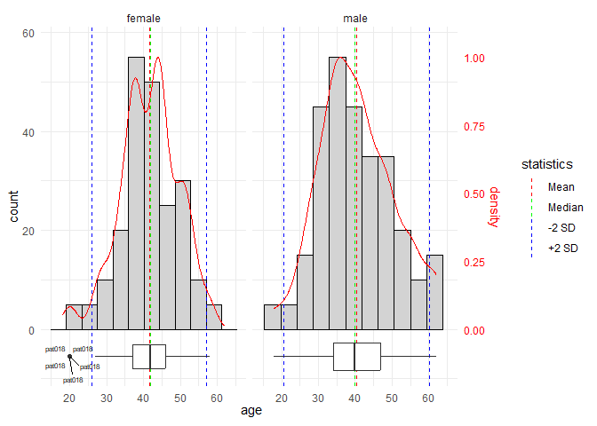
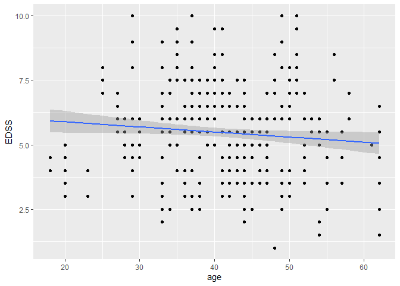
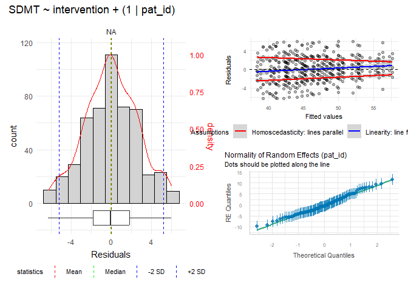
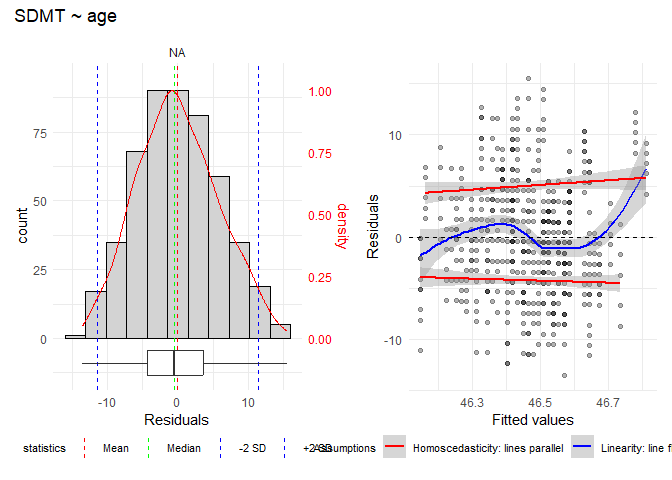

<!-- README.md is generated from README.Rmd. Please edit that file -->

# samspack

<!-- badges: start -->

[](https://github.com/snhof/samspack/actions/workflows/R-CMD-check.yaml)
<!-- badges: end -->

Samspack is a personal R package containing functions frequently used
in data analysis and visualization, with a focus on multiple sclerosis
(MS) research and eye-tracking data. It provides:

- **Multiple regression helpers** — run many regression models in one
  call and get a tidy summary table.
- **DEMoNS eye-tracking processing** — process raw output from the
  [DEMoNS
  protocol](https://www.protocols.io/view/demons-protocol-for-measurement-and-analysis-of-ey-x54v98eyml3e/v3)
  tasks (fixation, pro-saccades, anti-saccades, express saccades,
  double-step saccades, repeated saccades).
- **INO detection** — calculate versional dysconjugacy indices and
  determine presence of internuclear ophthalmoplegia (INO).
- **VFQ-25 scoring** — score the Visual Function Questionnaire-25
  (Dutch version).

## Installation

You can install the development version of samspack from
[GitHub](https://github.com/) with:

``` r
# install.packages("remotes")
remotes::install_github("snhof/samspack")
```

## Multiple regression helpers

The regression helper functions let you specify vectors of outcome
variables, predictors, and covariates. The functions then run every
combination and return a single tidy results table.

Four model types are supported:

| Function | Model type |
|---|---|
| `lm_mult()` | Linear regression (`lm`) |
| `lmer_mult()` | Linear mixed-effects model (`lmer`) |
| `glm_log_mult()` | Logistic regression (`glm`, binomial) |
| `geeglm_log_mult()` | Logistic GEE regression (`geeglm`) |

### Linear regression example

``` r
library(samspack)

lm_mult(
  data       = MS_trial_data,
  outcomes   = c("EDSS", "SDMT"),
  predictors = "age",
  covariates = c("", "+ gender")
)
#> # A tibble: 10 × 12
#>    model             outcome predictor covariate  formula          term        estimate std.error statistic p.value conf.low conf.high
#>    <chr>             <chr>   <chr>     <chr>      <chr>            <chr>          <dbl>     <dbl>     <dbl>   <dbl>    <dbl>     <dbl>
#>  1 Linear regression EDSS    age       ""         EDSS ~ age       (Intercept)  2.06819   0.33163   6.23601 0.00000  1.41626   2.72012
#>  2 Linear regression EDSS    age       ""         EDSS ~ age       age          0.02919   0.00808   3.61224 0.00032  0.01335   0.04503
#>  3 Linear regression EDSS    age       + gender   EDSS ~ age + g…  (Intercept)  2.03741   0.34907   5.83620 0.00000  1.35245   2.72237
#>  4 Linear regression EDSS    age       + gender   EDSS ~ age + g…  age          0.02896   0.00819   3.53611 0.00044  0.01290   0.04502
#>  5 Linear regression EDSS    age       + gender   EDSS ~ age + g…  genderMale   0.05697   0.19608   0.29053 0.77156 -0.32857   0.44251
#>  6 Linear regression SDMT    age       ""         SDMT ~ age       (Intercept) 37.69218   1.97839  19.05232 0.00000 33.81535  41.56901
#>  7 Linear regression SDMT    age       ""         SDMT ~ age       age         -0.10155   0.04817  -2.10841 0.03540 -0.19597  -0.00713
#>  8 Linear regression SDMT    age       + gender   SDMT ~ age + g…  (Intercept) 37.42175   2.08060  17.98636 0.00000 33.34107  41.50243
#>  9 Linear regression SDMT    age       + gender   SDMT ~ age + g…  age         -0.10018   0.04878  -2.05387 0.04044 -0.19580  -0.00456
#> 10 Linear regression SDMT    age       + gender   SDMT ~ age + g…  genderMale   0.47777   1.16853   0.40889 0.68288 -1.81276   2.76830
```

### Linear mixed-effects model example

``` r
lmer_mult(
  data       = MS_trial_data,
  outcomes   = c("EDSS", "SDMT"),
  predictors = c("intervention", "intervention * time"),
  covariates = c("", "+ age + gender"),
  randoms    = c("+ (1|pat_id)")
)
#> # A tibble: 88 × 23
#>    model_type        outcome predictor           covariate        random        formula                                  effect   group term                estimate std.error statistic    df p.value conf.low conf.high isSingular logLik deviance term_ranova    npar_ranova p_ranova
#>    <chr>             <chr>   <chr>               <chr>            <chr>         <chr>                                    <chr>    <chr> <chr>                  <dbl>     <dbl>     <dbl> <dbl>   <dbl>    <dbl>     <dbl> <lgl>       <dbl>    <dbl> <chr>                <dbl>    <dbl>
#>  1 Linear mixed model EDSS   intervention        ""               + (1|pat_id) EDSS ~ intervention + (1|pat_id)          fixed    NA    (Intercept)           4.15432   0.19856  20.92199   498 0.00000  3.76443   4.54421 FALSE      -852.7   1705.4 (1|pat_id)               3  0.00000
#>  2 Linear mixed model EDSS   intervention        ""               + (1|pat_id) EDSS ~ intervention + (1|pat_id)          fixed    NA    interventionTreatment  0.06217   0.17841   0.34847   498 0.72769 -0.28832   0.41266 FALSE      -852.7   1705.4 (1|pat_id)               3  0.00000
#>  3 Linear mixed model EDSS   intervention        ""               + (1|pat_id) EDSS ~ intervention + (1|pat_id)          ran_pars pat_… sd__(Intercept)        1.41879        NA        NA    NA      NA       NA        NA FALSE      -852.7   1705.4 (1|pat_id)               3  0.00000
#>  4 Linear mixed model EDSS   intervention        ""               + (1|pat_id) EDSS ~ intervention + (1|pat_id)          ran_pars Resi… sd__Observation        1.99421        NA        NA    NA      NA       NA        NA FALSE      -852.7   1705.4 (1|pat_id)               3  0.00000
#>  # … with 84 more rows
```

### Logistic regression example

``` r
glm_log_mult(
  data       = MS_trial_data,
  outcomes   = "INO",
  predictors = c("intervention", "age"),
  covariates = c("", "+ gender")
)
#> # A tibble: 14 × 12
#>    model                outcome predictor    covariate  formula                          term                  estimate std.error statistic p.value conf.low conf.high
#>    <chr>                <chr>   <chr>        <chr>      <chr>                            <chr>                    <dbl>     <dbl>     <dbl>   <dbl>    <dbl>     <dbl>
#>  1 Logistic regression  INO     intervention ""         INO ~ intervention               (Intercept)            0.26800   0.11213  -11.6088 0.00000  0.21538   0.33263
#>  2 Logistic regression  INO     intervention ""         INO ~ intervention               interventionTreatment  1.11957   0.17297    0.6533 0.51353  0.79858   1.56950
#>  3 Logistic regression  INO     intervention + gender  INO ~ intervention + gender       (Intercept)            0.26536   0.13403  -10.0217 0.00000  0.20424   0.34473
#>  4 Logistic regression  INO     intervention + gender  INO ~ intervention + gender       interventionTreatment  1.11697   0.17307    0.6381 0.52330  0.79669   1.56547
#>  5 Logistic regression  INO     intervention + gender  INO ~ intervention + gender       genderMale             1.02474   0.17289    0.1421 0.88701  0.73173   1.43514
#>  6 Logistic regression  INO     age          ""         INO ~ age                        (Intercept)            0.15714   0.09461  -17.7091 0.00000  0.11744   0.20888
#>  7 Logistic regression  INO     age          ""         INO ~ age                        age                    1.02561   0.00263    9.6668 0.00000  1.02044   1.03088
#>  8 Logistic regression  INO     age          + gender  INO ~ age + gender                (Intercept)            0.15512   0.11029  -15.7685 0.00000  0.11194   0.21468
#>  9 Logistic regression  INO     age          + gender  INO ~ age + gender                age                    1.02570   0.00265    9.6258 0.00000  1.02049   1.03099
#> 10 Logistic regression  INO     age          + gender  INO ~ age + gender                genderMale             1.02474   0.17289    0.1421 0.88701  0.73173   1.43514
#> # … with 4 more rows
```

### Logistic GEE regression example

``` r
geeglm_log_mult(
  data       = MS_trial_data,
  outcomes   = "INO",
  predictors = c("intervention", "intervention * time"),
  covariates = c("", "+ gender + age"),
  id         = "pat_id"
)
#> # A tibble: 16 × 11
#>    model        outcome predictor              covariate         formula                                           term                            estimate std.error statistic p.value conf.low
#>    <chr>        <chr>   <chr>                  <chr>             <chr>                                             <chr>                              <dbl>     <dbl>     <dbl>   <dbl>    <dbl>
#>  1 Logistic GEE INO     intervention           ""                INO ~ intervention                                (Intercept)                      0.26870   0.14018  3.67756 0.05217  0.20434
#>  2 Logistic GEE INO     intervention           ""                INO ~ intervention                                interventionTreatment            1.11957   0.22046  0.25791 0.61145  0.72693
#>  # … with 14 more rows
```

### Constructing formulas manually

`construct_formulas()` builds a data frame of all formula combinations,
which can be passed directly to any of the regression helpers or used
with base R model functions.

``` r
construct_formulas(
  outcomes   = c("EDSS", "SDMT"),
  predictors = "intervention",
  covariates = c("", "+ age"),
  randoms    = c("", "+ (1|pat_id)")
)
#> # A tibble: 8 × 5
#>   outcome predictor    covariate random        formula
#>   <chr>   <chr>        <chr>     <chr>         <chr>
#> 1 EDSS    intervention ""        ""            EDSS ~ intervention
#> 2 EDSS    intervention ""        + (1|pat_id)  EDSS ~ intervention + (1|pat_id)
#> 3 EDSS    intervention + age     ""            EDSS ~ intervention + age
#> 4 EDSS    intervention + age     + (1|pat_id)  EDSS ~ intervention + age + (1|pat_id)
#> 5 SDMT    intervention ""        ""            SDMT ~ intervention
#> 6 SDMT    intervention ""        + (1|pat_id)  SDMT ~ intervention + (1|pat_id)
#> 7 SDMT    intervention + age     ""            SDMT ~ intervention + age
#> 8 SDMT    intervention + age     + (1|pat_id)  SDMT ~ intervention + age + (1|pat_id)
```

## DEMoNS eye-tracking data processing

The `demons_process_*` functions add derived parameters and dichotomous
outcome variables (based on published cut-offs) to raw DEMoNS output.
Each function corresponds to one task in the protocol.

| Function | Task |
|---|---|
| `demons_process_fix()` | Fixation |
| `demons_process_prosac()` | Pro-saccades |
| `demons_process_antisac()` | Anti-saccades |
| `demons_process_expsac()` | Express saccades |
| `demons_process_dblstep()` | Double-step saccades |
| `demons_process_repsac()` | Repeated saccades |

Example datasets (`DEMoNS_data`, `DEMoNS_data_fix`,
`DEMoNS_data_prosac`, etc.) are included for testing and demonstration.

``` r
demons_process_fix(DEMoNS_data_fix, keep_essential = TRUE, add_prefix = TRUE)
```

## INO detection

`calcINO()` (a wrapper for `demons_process_INO()`) processes
pro-saccades data and uses versional dysconjugacy index (VDI) cut-off
values to classify eyes as INO-positive or INO-negative.

``` r
calcINO(DEMoNS_data_prosac)
```

## VFQ-25 scoring

`VFQ_scoring()` converts raw Dutch-language VFQ-25 questionnaire
responses to numerical subscale scores and a composite total score.

``` r
# df is a data frame with columns named VFQ1 through VFQ25
VFQ_scoring(df)
```

## Checking distributions and outliers

### check_histograms()

`check_histograms()` is one of the most frequently used functions in
the package. It iterates over every numeric variable in a data frame
and returns a list of histograms, each showing the mean, median, ±2 SD
lines, a boxplot, a density curve, and outlier labels.

``` r
check_histograms(data = MS_trial_data, id = pat_id, facet_cols = gender)[[1]]
```



Use `wrap_plots_split()` to display the list of plots across multiple
pages (4 plots per page by default):

``` r
check_histograms(data = MS_trial_data, id = pat_id) |> wrap_plots_split()
```

`histogram_sp()` creates a single histogram with the same annotations
and is the underlying function called by `check_histograms()`.

### check_scatterplots()

`check_scatterplots()` creates scatterplots for all combinations of
specified outcome and predictor variables, with outliers automatically
labeled.

``` r
check_scatterplots(
  data       = MS_trial_data,
  outcomes   = c("EDSS", "SDMT"),
  predictors = c("age", "time"),
  id         = "pat_id"
)[[1]]
```



## Checking model assumptions

### lmer_assump_tests()

`lmer_assump_tests()` takes a fitted `lmer` model and returns a
combined plot for checking the three key assumptions: normality of
residuals (histogram), linearity (residuals vs fitted), and normality
of random effects (QQ-plot).

``` r
model <- lme4::lmer(SDMT ~ intervention + (1|pat_id), data = MS_trial_data, REML = FALSE)
lmer_assump_tests(model)
```



`lmer_mult_assump_tests()` is a convenience wrapper that mirrors
`lmer_mult()` and returns an assumption-check plot for every model in
the batch.

### lm_assump_tests()

`lm_assump_tests()` takes a fitted `lm` model and returns a combined
plot for normality of residuals and linearity/homoscedasticity.

``` r
lm(SDMT ~ age, data = MS_trial_data) |> lm_assump_tests()
```



`lm_mult_assump_tests()` is a convenience wrapper that mirrors
`lm_mult()` and returns an assumption-check plot for every model in the
batch.

## Function reference

Below is a complete list of all exported functions grouped by category.

### Multiple regression — run models

| Function | Description |
|---|---|
| `construct_formulas()` | Build a data frame of all formula combinations from vectors of outcomes, predictors, covariates and random effects |
| `lm_mult()` | Run multiple linear regression models (`lm`) and return a tidy results table |
| `lmer_mult()` | Run multiple linear mixed-effects models (`lmer`) and return a tidy results table |
| `glm_log_mult()` | Run multiple logistic regression models (`glm`, binomial) and return a tidy results table |
| `geeglm_log_mult()` | Run multiple logistic GEE regression models (`geeglm`) and return a tidy results table |

### Multiple regression — assumption checks

| Function | Description |
|---|---|
| `lm_assump_tests()` | Assumption-check plots for a single `lm` model |
| `lm_mult_assump_tests()` | Assumption-check plots for a batch of `lm` models |
| `lmer_assump_tests()` | Assumption-check plots for a single `lmer` model |
| `lmer_mult_assump_tests()` | Assumption-check plots for a batch of `lmer` models |

### Exploratory data analysis

| Function | Description |
|---|---|
| `check_histograms()` | Histograms with mean, median, ±2 SD, boxplot, density and outlier labels for all numeric variables in a data frame |
| `histogram_sp()` | Single histogram with the same annotations as `check_histograms()` |
| `check_scatterplots()` | Scatterplots for all outcome × predictor combinations with outlier labels |
| `is_outlier()` | Detect outliers using the Tukey method (Q1/Q3 ± 1.5 × IQR) |
| `wrap_plots_split()` | Split a list of ggplot objects into pages of *n* plots |

### DEMoNS eye-tracking

| Function | Description |
|---|---|
| `demons_process_fix()` | Process fixation task data |
| `demons_process_prosac()` | Process pro-saccades task data |
| `demons_process_antisac()` | Process anti-saccades task data |
| `demons_process_expsac()` | Process express saccades task data |
| `demons_process_dblstep()` | Process double-step saccades task data |
| `demons_process_repsac()` | Process repeated saccades task data |
| `calcINO()` | Calculate VDI metrics and classify INO from pro-saccades data |

### Questionnaires and clinical scores

| Function | Description |
|---|---|
| `VFQ_scoring()` | Score the Dutch VFQ-25 questionnaire into subscale and total scores |

### Saving plots

| Function | Description |
|---|---|
| `ggsavepp()` | Save a ggplot with dimensions optimised for a PowerPoint slide |
| `ggsavepphalf()` | Save a ggplot at half PowerPoint slide width |
| `ggsaveppfull()` | Save a ggplot at full PowerPoint slide dimensions |
| `ggsaveppquart()` | Save a ggplot at quarter PowerPoint slide dimensions |
| `ggsavemagnify()` | Save a ggplot with a custom magnification factor |
